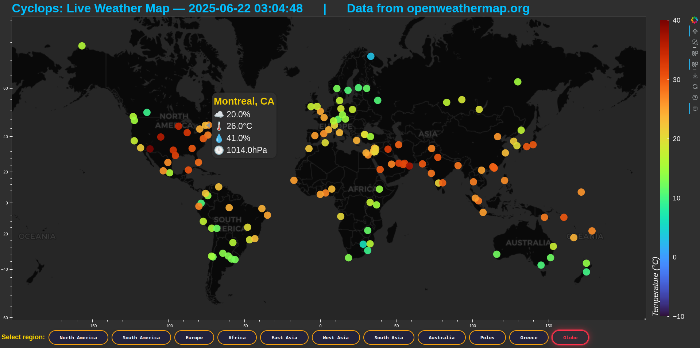
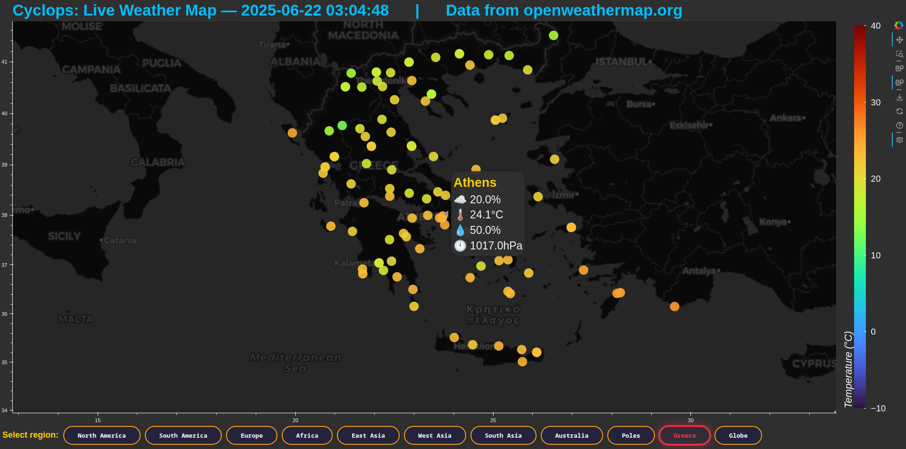

# Cyclops 🌍  
**Live Global Weather Map Explorer**

##### Cyclops is an interactive, real-time meteorological visualization tool built with Python and Bokeh. Instantly see cloud cover, temperature, humidity, and pressure at cities and weather stations around the globe—grouped by continent, region, or even country. Ideal for researchers, educators, and weather enthusiasts.


---

## 🚀 Features

- **Live Data:** Fetches current weather data from OpenWeatherMap API.
- **Global Coverage:** Hundreds of cities and towns, spanning all continents and climate zones.
- **Region Filter:** Instantly toggle between North America, South America, Europe, Africa, East Asia, West Asia, Australia/Oceania, Poles, Greece, and a “Globe” sample.
- **Interactive Map:**  
  - Dark theme, smooth zoom & pan  
  - Hover for instant weather details  
  - Temperature color-coded markers
- **Extendable:** Add more cities, weather stations, or custom regions with ease.

---

## 🖥️ Demo

Try it live:  
[https://py.cafe/app/mixstam1821/Cyclops](https://py.cafe/app/mixstam1821/Cyclops)

---

## 📦 Setup & Usage

1. **Clone or open the project on [py.cafe](https://py.cafe), Replit, or your local machine.**

2. **Requirements:**  
   - Python 3.8+
   - Packages: `bokeh`, `requests`, `numpy`

3. **Install dependencies:**  
   ```sh
   pip install -r requirements.txt
   bokeh serve --show Cyclops.py
    ```

OR
using Docker:
```
git clone https://github.com/mixstam1821/Cyclops.git
cd Cyclops

# Build your image
docker build -t cyclops-app .

# Run the container
docker run -p 8000:8000 cyclops-app
```
